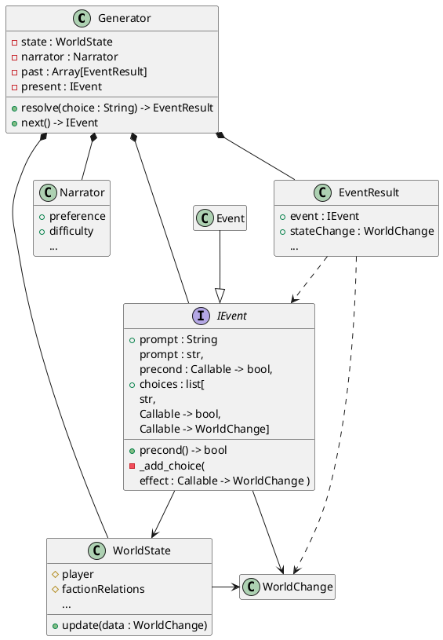

```plantuml
@startuml
hide empty members

class Generator
{
    -state : WorldState
    -narrator : Narrator
    -past : Array[EventResult]
    -present : IEvent
    +resolve(choice : String) -> EventResult
    +next() -> IEvent
}

class WorldState
{
    +update(data : WorldChange)
    #player
    #factionRelations
    ...
}

class WorldChange
{
}

class Narrator
{
    +preference
    +difficulty
    ...
}

Interface IEvent
{
    +prompt : String
    +precond() -> bool
    -_add_choice(
        prompt : str, 
        precond : Callable -> bool, 
        effect : Callable -> WorldChange )
    +choices : list[
        str,
        Callable -> bool, 
        Callable -> WorldChange]
}

class Event
Event --|> IEvent

class EventResult
{
    +event : IEvent
    +stateChange : WorldChange
    ...
}

Generator *-- WorldState
Generator *-- IEvent
Generator *-- Narrator
Generator *-- EventResult
IEvent --> WorldState
IEvent --> WorldChange
WorldState -> WorldChange

EventResult ..> IEvent
EventResult ..> WorldChange
@enduml
```