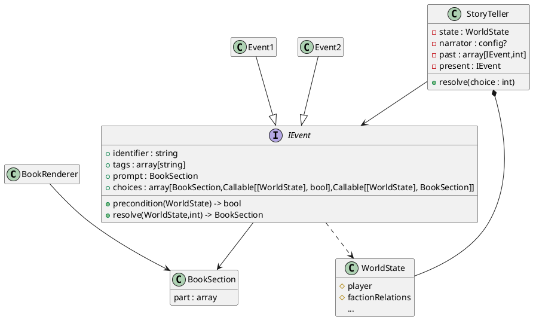

```plantuml
@startuml
hide empty members

class BookRenderer

class StoryTeller
{
    -state : WorldState
    -narrator : config?
    -past : array[IEvent,int]
    -present : IEvent
    +resolve(choice : int)
}

class WorldState
{
    #player
    #factionRelations
    ...
}

Interface IEvent
{
    +identifier : string
    +tags : array[string]
    +prompt : BookSection
    +precondition(WorldState) -> bool
    +choices : array[BookSection,Callable[[WorldState], bool],Callable[[WorldState], BookSection]]
    +resolve(WorldState,int) -> BookSection
}

class BookSection
{
    part : array
}

class Event1
class Event2

Event1 --|> IEvent
Event2 --|> IEvent

StoryTeller *-- WorldState
StoryTeller --> IEvent
IEvent ..> WorldState
IEvent --> BookSection
BookRenderer --> BookSection

@enduml
```