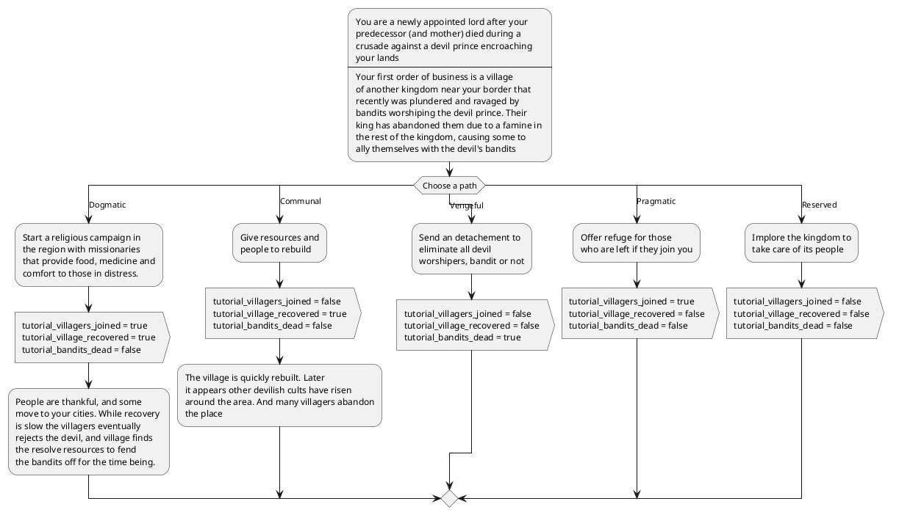

```plantuml

@startuml

:You are a newly appointed lord after your 
predecessor (and mother) died during a 
crusade against a devil prince encroaching
your lands
----
Your first order of business is a village 
of another kingdom near your border that 
recently was plundered and ravaged by 
bandits worshiping the devil prince. Their 
king has abandoned them due to a famine in 
the rest of the kingdom, causing some to 
ally themselves with the devil's bandits;

switch (Choose a path)
case (Dogmatic)
    :Start a religious campaign in
    the region with missionaries
    that provide food, medicine and
    comfort to those in distress.;
    :tutorial_villagers_joined = true
    tutorial_village_recovered = true
    tutorial_bandits_dead = false; <<output>>
    :People are thankful, and some 
    move to your cities. While recovery 
    is slow the villagers eventually 
    rejects the devil, and village finds
    the resolve resources to fend
    the bandits off for the time being.;
case (Communal)
    :Give resources and 
    people to rebuild;
    :tutorial_villagers_joined = false
    tutorial_village_recovered = true
    tutorial_bandits_dead = false; <<output>>
    :The village is quickly rebuilt. Later 
    it appears other devilish cults have risen
    around the area. And many villagers abandon
    the place;
case (Vengeful)
    :Send an detachement to 
    eliminate all devil
    worshipers, bandit or not;
    :tutorial_villagers_joined = false
    tutorial_village_recovered = false
    tutorial_bandits_dead = true; <<output>>
case (Pragmatic)
    :Offer refuge for those 
    who are left if they join you;
    :tutorial_villagers_joined = true
    tutorial_village_recovered = false
    tutorial_bandits_dead = false; <<output>>
case (Reserved)
    :Implore the kingdom to 
    take care of its people;
    :tutorial_villagers_joined = false
    tutorial_village_recovered = false
    tutorial_bandits_dead = false; <<output>>
endswitch

@enduml

```